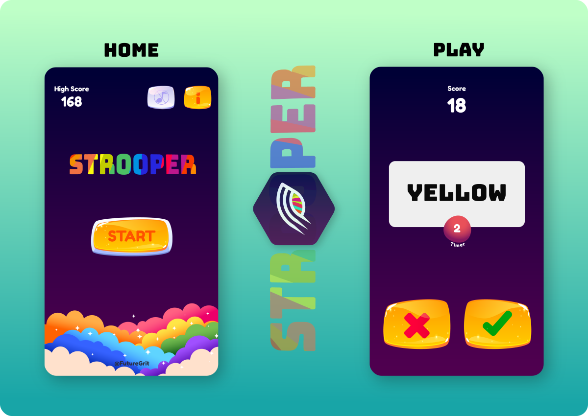

```NOTE: This application is still under development. Stay Tuned.```
# Strooper 
***Challenge your speed of processing.***

Strooper is a game to test the coordination ability between cognitive and visual response of the user.


We would like to build this game to have fun challenges and to entertain users, to see if they can make the proper coordination of the cognitive and visual perception and select the correct option.





## Roadmap
* Implementation of "Home" screen:
    - Custom app bar (high score, sound option and info icon).
    - Add app name image "STROOPER". 
    - Add "START" button.
    - Add "Cloud" in botton of the screen.
* Implementation of "Play" screen.
* Performance Improvement
* Testing
